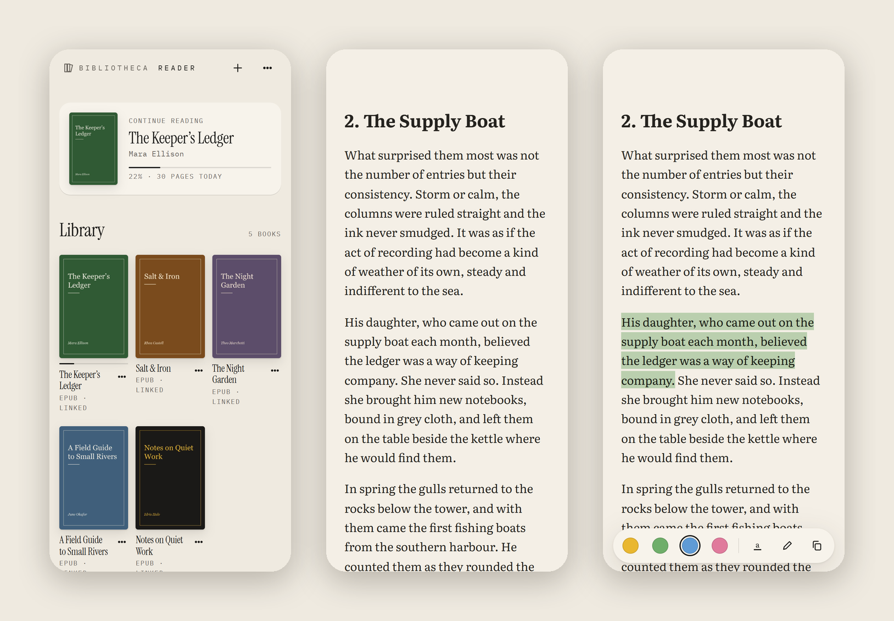
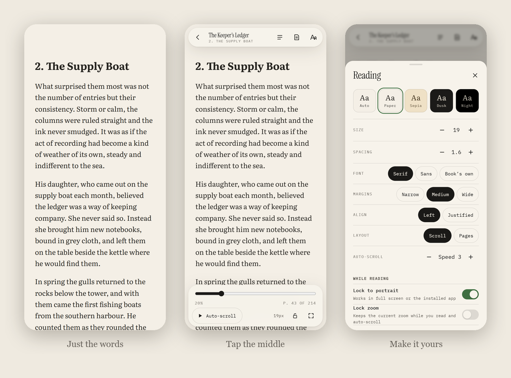
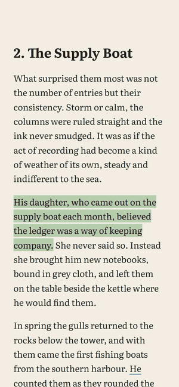
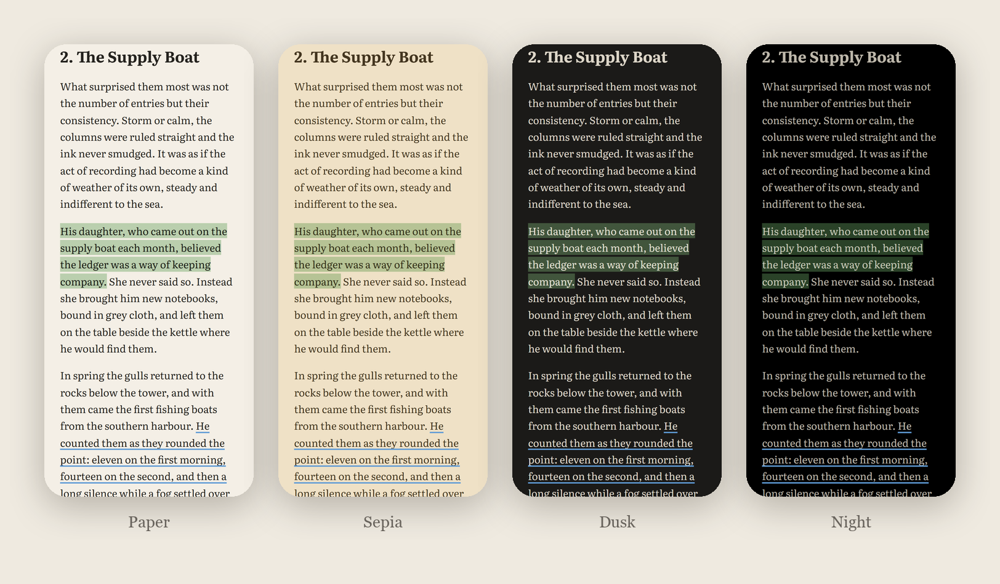
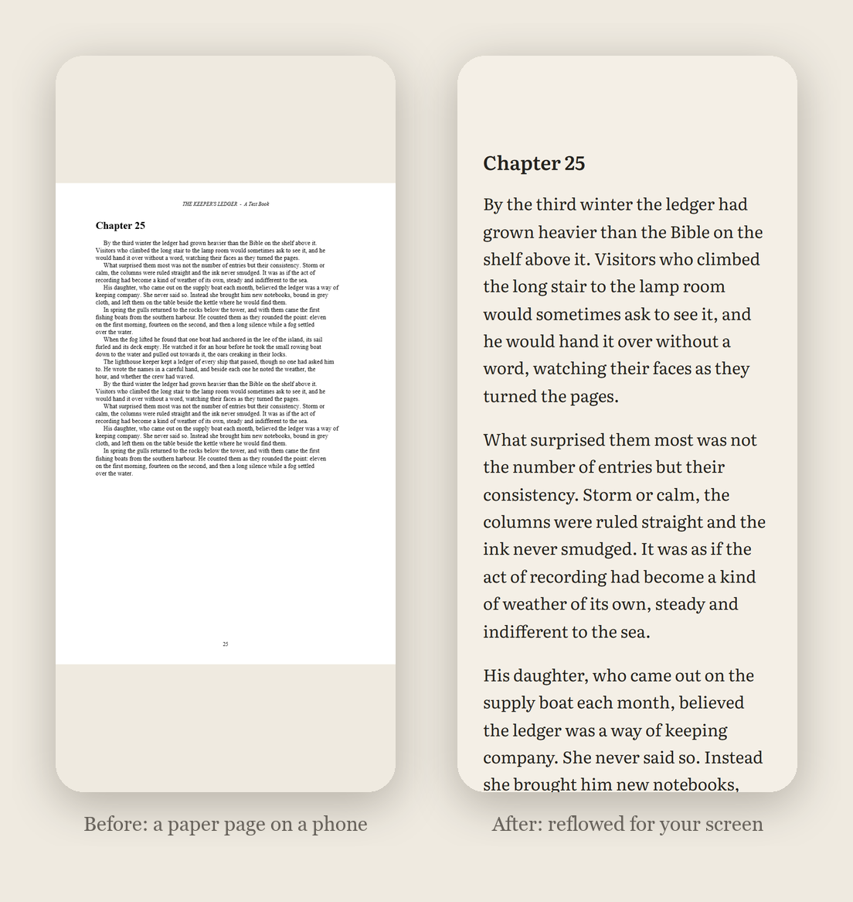
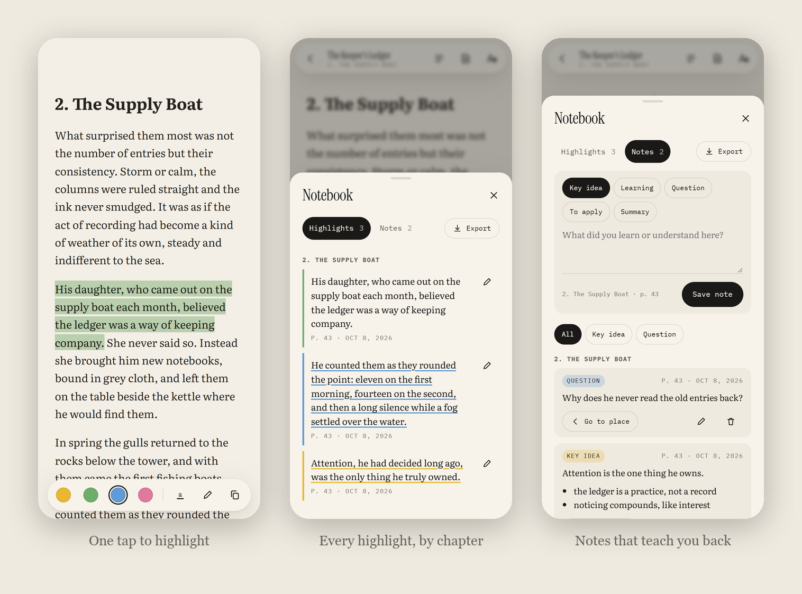
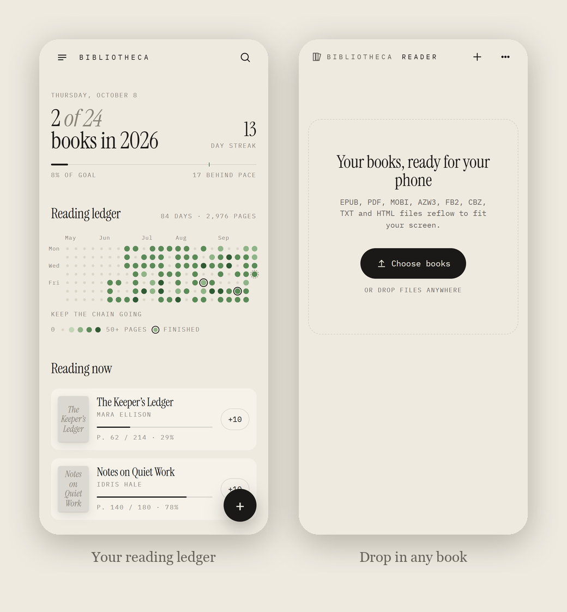
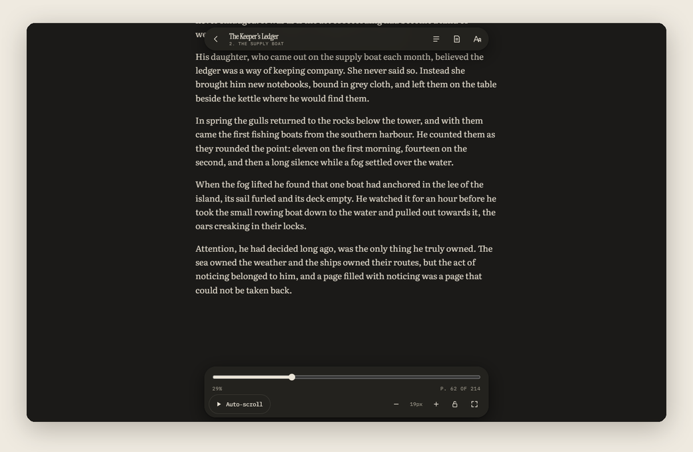

<div align="center">

# Bibliotheca

**Your books. Your phone. Nothing in between.**

A reading tracker and a beautiful e-book reader in one small web app.<br>
No account. No server. No ads. It installs like an app and works offline.

[**Open the app →**](https://shreyashgawas07.github.io/BIBLIOTHECA/) &nbsp;·&nbsp; [Open the reader](https://shreyashgawas07.github.io/BIBLIOTHECA/reader/) &nbsp;·&nbsp; [Contribute](CONTRIBUTING.md)



</div>

---

## Reading on a phone is broken.

You download a book. You open it. And it fights you.

The PDF is shaped like a sheet of paper, so the words are tiny. You pinch. You rotate. You scroll sideways to finish a line. The battery icon and the clock stare at you. Your highlights vanish into some app you'll never open again. You have five books in four formats spread across three apps, and none of them remembers what you learned.

We thought reading deserved better. So we made **Bibliotheca**.

## It's just the words.

<p align="center">
  
</p>

Open a book and the interface disappears. No toolbars, no buttons. Just a well-set page in Literata, a typeface designed for long reading on screens.

Tap the middle of the page and the controls slide in. Leave them alone for three seconds and they slide away. Size, spacing, margins, font and theme are one sheet away, and they apply instantly.

## It scrolls for you.

<p align="center">
  
</p>

Press **Auto-scroll** and the text glides upward at the pace you choose, from a slow drift to a brisk read. Put a finger on the screen and it waits for you. Lift it, and it carries on.

Pinch to zoom, and the page follows your fingers. Tap the lock, and it stays exactly where you set it, even while it scrolls. Lock the screen to portrait. Go full screen and even the status bar disappears.

## Every book. One feeling.

EPUB. PDF. MOBI. AZW3. FB2. CBZ. TXT. HTML. Drop them in, and they all read the same way: same type, same themes, same gestures. It doesn't matter where the book came from. It feels like it was made for your phone.

<p align="center">
  
</p>

## And PDFs? We rebuilt them.

This is the hard one. A PDF isn't text. It's ink positioned on a page. So Bibliotheca reads the page the way you do. It finds the lines and joins them into paragraphs. It strips the running headers and page numbers, mends words broken by hyphens, and reads two-column layouts in the right order. Then it lays the text out again for your screen.

<p align="center">
  
</p>

Want the original page? One tap. Scanned book with no text? It notices, and shows you the pages instead.

## Highlights that teach you back.

<p align="center">
  
</p>

Tap the pencil, then drag your finger over a sentence. That's it, it's saved, with no browser menus popping up over the page. Four colours, three styles: highlight, underline, squiggle. Or select text the usual way and tap a colour.

Every book gets its own **notebook**. Highlights are gathered by chapter. Your notes are typed, *Key idea*, *Learning*, *Question*, *To apply*, *Summary*, and each one remembers the page you were on. Tap any of them and you're back in the book, at that exact sentence. Export everything to Markdown whenever you like.

## And it remembers.

<p align="center">
  
</p>

Bibliotheca started as a reading tracker: your yearly goal, your streak, and a **reading ledger** where every day you read becomes a dot.

Now the reader and the tracker are one. Read twenty pages and Bibliotheca knows: the ledger fills in, the streak holds, and the book moves to *Finished* when you reach the last page. Jumping around with the contents or the slider doesn't count. Only reading does.

## It's yours. Completely.

- **No account, no server.** Your books, highlights and notes live in your browser on your device, and nowhere else.
- **No tracking.** No analytics, no ads, no network calls carrying your books or notes. Ever.
- **Works offline.** After the first visit, it opens on a plane.
- **Safe.** Scripts hidden inside book files are blocked. DRM-protected books get an honest message, not a crash.
- **Backup in one tap.** Export your whole library, or just your notes, to a single file.

## It works on the big screen too.

<p align="center">
  
</p>

Phone first, never phone only. On a laptop the controls appear when you move the mouse, panels open as side drawers, and arrow keys, Space and Page Up/Down do what you expect.

---

## Get it

**On your phone (Android, Chrome):** open **[shreyashgawas07.github.io/BIBLIOTHECA](https://shreyashgawas07.github.io/BIBLIOTHECA/)**, then tap ⋮ → **Install app**. It now lives on your home screen, without the browser bar.

**Run it yourself.** There's no build step and nothing to install:

```bash
git clone https://github.com/ShreyashGawas07/BIBLIOTHECA.git
cd BIBLIOTHECA
python -m http.server 8765
```

Open http://localhost:8765. Any static file server works, and so does any static host (GitHub Pages, Netlify, Cloudflare Pages).

## How it's built

Plain HTML, CSS and JavaScript modules. No framework, no bundler, no `node_modules`. You can read the whole thing in an afternoon.

```
index.html, sw.js, manifest.json   Bibliotheca: tracker, ledger, offline support, install
reader/
  index.html                       reader shell + Content-Security-Policy
  css/app.css                      every style; theme tokens at the top
  js/app.js                        library, import, routing, backup
  js/reader.js                     reading screen, controls, zoom, progress sync
  js/pdf-reflow.js                 PDF → phone text
  js/highlights.js, js/notes.js    highlights, notebook, Markdown export
  js/autoscroll.js                 auto-scroll, wake lock, orientation, full screen
  js/bridge.js                     the only code that touches Bibliotheca's data
  js/db.js                         IndexedDB storage + backup
  vendor/foliate/                  foliate-js + PDF.js (pinned, see VERSION.txt)
```

Rendering stands on the shoulders of [foliate-js](https://github.com/johnfactotum/foliate-js) and [PDF.js](https://mozilla.github.io/pdf.js/). The technical details, supported formats and known limitations are in **[reader/README.md](reader/README.md)**, and the design decisions are in **[reader/DESIGN.md](reader/DESIGN.md)**.

## Make it better

Bibliotheca is open source and wants your help. Fix a bug, tune the PDF engine, add a theme, translate it, or build the feature you wish it had.

- Read **[CONTRIBUTING.md](CONTRIBUTING.md)**. It takes five minutes, and you can be running the app in one.
- Browse **[open issues](https://github.com/ShreyashGawas07/BIBLIOTHECA/issues)**, or open one with your idea.
- Ideas we'd love: search inside a book, sync across devices, text-to-speech, more languages, a better comic reader.

Please read the **[Code of Conduct](CODE_OF_CONDUCT.md)**. Found a security issue? See **[SECURITY.md](SECURITY.md)**.

## License

[MIT](LICENSE). Use it, change it, share it. Bundled libraries and fonts keep their own licenses; see [THIRD_PARTY_NOTICES.md](THIRD_PARTY_NOTICES.md).

<div align="center"><br><i>Made for people who read.</i></div>
